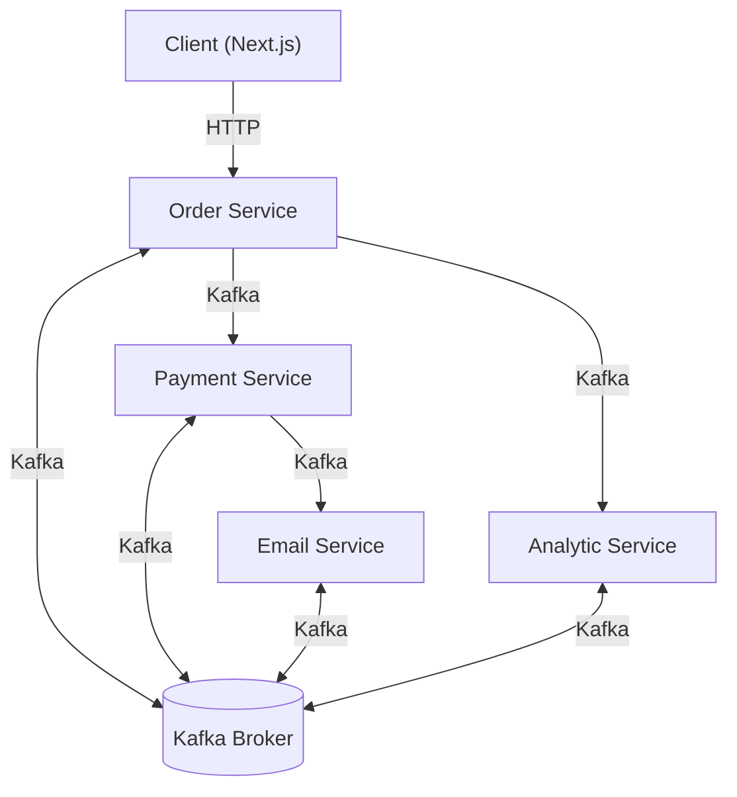

# Microservices-Kafka

A microservices-based project leveraging Apache Kafka for inter-service communication. This repository demonstrates a modular architecture with independent services for analytics, email, orders, payments, and a client frontend, all orchestrated via Kafka. **The project is designed with fault tolerance in mind, ensuring high availability and resilience of services.**

---

## Architecture Overview


flowchart TD

    subgraph KRaft
        zk[KRaft]
    end

    subgraph Kafka_Cluster

        subgraph Broker_1["Broker: kafka1\nController: Leader"]
            p1["prospect-partition-0"]
            o1["order-partition-0"]
            c1["config-partition-0"]
        end

        subgraph Broker_2["Broker: kafka2\nController: Follower"]
            p2["prospect-partition-1"]
            o2["order-partition-1"]
            c2["config-partition-1"]
        end

        subgraph Broker_3["Broker: kafka3\nController: Follower"]
            p3["prospect-partition-2"]
            o3["order-partition-2"]
            c3["config-partition-2"]
        end

    end

    zk --> Broker_1
    zk --> Broker_2
    zk --> Broker_3

    style zk fill:#eee,stroke:#666,stroke-width:1px
    style Kafka_Cluster stroke-dasharray: 5 5

---
flowchart LR

    %% Services
    PaymentService((Payment service))
    OrderService((Order service))
    BrandService((Brand service))
    AnalyticsService((Analytics service))

    %% Kafka Nodes
    PaymentProducer["Kafka Producer"]
    PaymentConsumer["Kafka Consumer"]

    OrderProducer["Kafka Producer"]
    OrderConsumer["Kafka Consumer"]

    BrandProducer["Kafka Producer"]
    BrandConsumer["Kafka Consumer"]

    AnalyticsProducer["Kafka Producer"]
    AnalyticsConsumer["Kafka Consumer"]

    %% Sync Services
    PaymentSync["PaymentSyncService()"]
    OrderSync["OrderSyncService()"]
    BrandSync["BrandSyncService()"]

    %% Connections
    PaymentService --> PaymentProducer --> PaymentSync
    PaymentService --> PaymentConsumer --> PaymentSync

    OrderService --> OrderProducer --> OrderSync
    OrderService --> OrderConsumer --> OrderSync

    BrandService --> BrandProducer --> BrandSync
    BrandService --> BrandConsumer --> BrandSync

    AnalyticsService --> AnalyticsProducer
    AnalyticsService --> AnalyticsConsumer

    AnalyticsProducer --> PaymentSync
    AnalyticsProducer --> OrderSync
    AnalyticsProducer --> BrandSync

    AnalyticsConsumer --> PaymentSync
    AnalyticsConsumer --> OrderSync
    AnalyticsConsumer --> BrandSync

    %% Optional - Draw lines from syncs back to consumers for completeness
    PaymentSync --> PaymentConsumer
    OrderSync --> OrderConsumer
    BrandSync --> BrandConsumer

---

---

## Services

- **client**: Frontend application (Next.js) for user interaction.
- **Order-service**: Handles order creation and management.
- **Payment-service**: Processes payments for orders.
- **Email-service**: Sends email notifications (e.g., order confirmations).
- **Analytic-service**: Collects and analyzes order/payment data.
- **Kafka**: Contains Kafka broker setup and admin scripts.

---

## Fault Tolerance

This project is built with fault tolerance as a core principle:

- **Container Restart Policies**: Docker Compose is configured to automatically restart containers if they fail, ensuring services recover from crashes or unexpected shutdowns.
- **Stateless Microservices**: Each service is designed to be stateless, allowing for easy recovery and horizontal scaling without data loss.
- **Kafka Durability**: Kafka provides message durability and guarantees delivery, so messages are not lost even if a service is temporarily unavailable.
- **Loose Coupling**: Services communicate asynchronously via Kafka, reducing dependencies and minimizing the impact of individual service failures.
- **Resilient Communication**: If a service is down, Kafka retains messages until the service is back online and able to process them.

---

## Prerequisites

- [Node.js](https://nodejs.org/) (v16+ recommended)
- [Docker](https://www.docker.com/) (for Kafka broker)
- [npm](https://www.npmjs.com/) (comes with Node.js)

---

## Setup & Installation

1. **Clone the repository:**
   ```bash
   git clone https://github.com/yourusername/Microservices-Kafka.git
   cd Microservices-Kafka/Services
   ```

2. **Install dependencies for each service:**
   ```bash
   cd Analytic-service && npm install
   cd ../Order-service && npm install
   cd ../Payment-service && npm install
   cd ../Email-service && npm install
   cd ../client && npm install
   cd ../Kafka && npm install
   ```

3. **Start Kafka broker (using Docker Compose):**
   ```bash
   cd ../Kafka
   docker-compose up -d
   ```

---

## Running the Services

Open a terminal for each service and run:

```bash
# Analytic Service
cd Services/Analytic-service
npm start

# Order Service
cd Services/Order-service
npm start

# Payment Service
cd Services/Payment-service
npm start

# Email Service
cd Services/Email-service
npm start

# Client (Next.js)
cd Services/client
npm run dev
```

---

## Kafka Usage

- Kafka is used as the message broker for asynchronous communication between services, providing durability and resilience in the event of service failures.
- Topics are used for events such as order creation, payment processing, and analytics.
- The Kafka broker is managed via Docker Compose in the `Services/Kafka` directory.
- **Fault tolerance:** If a consumer service is down, Kafka retains messages until the service is available again, ensuring no data loss.

---

## API Endpoints

> _**Note:** Please refer to each service's code for specific API endpoints. Typically, the Order Service exposes HTTP endpoints consumed by the client._

---

## Development & Contribution

1. Fork the repository and create your branch:
   ```bash
   git checkout -b feature/your-feature
   ```
2. Make your changes and commit:
   ```bash
   git commit -m "Add your message"
   ```
3. Push and create a pull request.

---

## License

This project is licensed under the MIT License. 